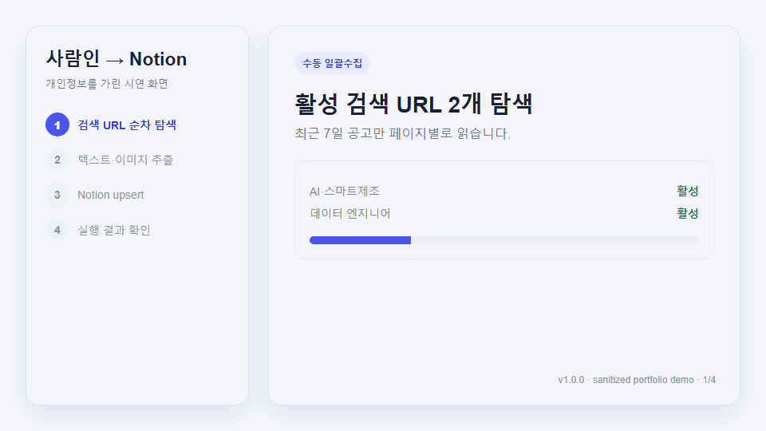
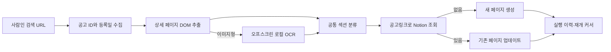

# 사람인 채용공고 → Notion 추출기

사람인 공고를 다시 읽고 정리하는 반복 작업을 줄이기 위해 만든 개인용 Chrome 확장 프로그램입니다. 텍스트 공고와 이미지형 공고를 같은 구조로 추출하고, 여러 검색 URL을 순차 수집해 Notion 데이터 소스에 생성 또는 업데이트합니다.

> 포트폴리오 v1.0.0 범위: 개인용 Notion 내부 연결, 주 1회 예약, 사람인 전용 스키마. Chrome Web Store, OAuth, LLM 요약, 범용 Notion 스키마는 포함하지 않습니다.

## 핵심 기능

- 일반 상세·이어보기·이미지형 공고를 동일한 JSON 구조로 변환
- 이미지형 공고는 확장 프로그램 안의 Tesseract.js로 한국어·영어 OCR 처리
- 검색 URL을 `{id, name, url, enabled}` 형태로 여러 개 관리
- 최근 N일, URL당 최대 페이지, 전체 최대 공고 수를 적용한 순차 수집
- `공고링크(rec_idx)` 기준 Notion upsert로 재실행 시 중복 페이지 방지
- 네트워크·429·5xx·페이지 로딩 오류만 지수 백오프와 jitter로 재시도
- 중지, 비정상 종료 후 재개, 최근 20회 실행 이력 및 실행당 오류 20건 보관
- 현지 시간 기준 주 1회 예약과 Chrome 재시작 시 1회 보충 실행



## 데이터 흐름



## 설치

### Release ZIP

1. GitHub Releases의 `saramin-notion-extractor-v1.0.0.zip`을 내려받아 압축을 풉니다.
2. Chrome 주소창에서 `chrome://extensions`를 엽니다.
3. **개발자 모드**를 켜고 **압축해제된 확장 프로그램을 로드합니다**를 누릅니다.
4. 압축을 푼 `saramin-notion-extractor` 폴더를 선택합니다.

### 소스에서 설치

저장소를 내려받은 뒤 위 2~4단계에서 저장소 루트를 선택합니다. 확장 프로그램 실행에는 빌드가 필요하지 않습니다.

## Notion 연결 준비

1. Notion의 **설정 → 연결 → 자체 연결 개발**에서 내부 연결을 만듭니다.
2. 콘텐츠 읽기·삽입·업데이트 권한을 켜고 설치 액세스 토큰을 복사합니다.
3. 채용공고 데이터베이스의 **••• → 연결 추가**에서 방금 만든 연결을 선택합니다.
4. 데이터베이스 설정의 **데이터 소스 관리 → ••• → 데이터 소스 ID 복사**를 누릅니다.
5. 확장 프로그램의 **Notion 연결 설정**에 토큰과 데이터 소스 ID를 붙여 넣고 **연결 테스트**를 실행합니다.

> 데이터베이스 URL에 들어 있는 데이터베이스 ID나 `?v=` 뒤의 보기 ID가 아니라, 반드시 **데이터 소스 ID**를 입력해야 합니다. 처음 연결하는 사용자는 [토큰 발급 및 연결 상세 가이드](docs/notion-setup.md)를 먼저 확인하세요.

| 속성 | Notion 유형 |
|---|---|
| 회사/직무(제목) | 제목 |
| 공고링크 | URL |
| 주요업무, 지원자격, 우대사항 | 텍스트 |
| 기술스택 | 다중 선택 |
| 자격/어학, 근무조건/복지, 지역 | 텍스트 |
| 마감일 | 날짜 |

토큰과 데이터 소스 ID는 소스 코드나 fixture에 포함되지 않으며 Chrome 확장 프로그램 전용 로컬 저장소에만 저장됩니다. 토큰을 GitHub, 스크린샷, JSON 예시에 올리지 마세요. 공용 PC에서는 사용 후 **저장된 토큰 삭제**를 누르세요.

## 사용법

### 현재 공고 한 건 저장

1. 사람인 상세 공고를 연 뒤 확장 프로그램에서 **페이지 스캔**을 누릅니다.
2. 이미지형으로 감지되면 **이미지 OCR로 읽기**를 누릅니다.
3. 미리보기 내용을 확인하고 **Notion에 저장**을 누릅니다.

### 여러 검색 URL 수집

1. **자동 수집 설정**에서 검색 이름과 사람인 검색 URL을 추가합니다.
2. 최근 등록일, 페이지·공고 제한, 재시도 횟수와 요청 간격을 저장합니다.
3. **지금 자동 수집**을 누릅니다. 중지는 현재 안전 작업이 끝난 뒤 반영됩니다.

### 주간 예약

**주 1회 자동 실행**을 켜고 ISO 요일과 시각을 저장합니다. 기본값은 월요일 09:00이며 브라우저가 사용하는 현지 시간 기준입니다. 예약 시각에 Chrome이 꺼져 있었다면 다음 시작 때 같은 주에 한 번만 보충 실행을 시도합니다. 활성 검색 URL, 토큰 또는 데이터 소스 ID가 없으면 해결 방법이 포함된 실패 이력을 남깁니다.

## 권한 사용 이유

| 권한 | 이유 |
|---|---|
| `activeTab`, `scripting` | 사용자가 연 사람인 공고와 백그라운드 수집 탭에서 내용을 읽기 위해 사용 |
| `storage` | 연결 설정, 검색 URL, 재개 커서와 실행 이력을 이 브라우저에 저장 |
| `alarms` | 사용자가 정한 주간 예약을 실행 |
| `offscreen` | 서비스 워커 밖에서 로컬 OCR worker를 실행 |
| 사람인 host 권한 | 검색·상세 페이지와 공고 이미지를 읽기 위해 사용 |
| Notion API host 권한 | 사용자가 연결한 데이터 소스에 조회·생성·업데이트 요청 |

## 안정성 설계

- 처리 완료 후에만 `{searchIndex, currentPage, nextJobIndex}` 커서를 전진시킵니다.
- 중간 장애로 같은 공고를 다시 처리해도 링크 기반 upsert가 기존 페이지를 갱신합니다.
- 401·403·404는 토큰·권한·ID 설정 오류로 보고 전체 실행을 즉시 중단합니다.
- 개별 DOM 파싱·OCR 실패는 오류에 기록하고 다음 공고로 진행합니다.
- 실행 이력에는 토큰과 Notion 응답 본문을 저장하지 않습니다.

## OCR 한계와 문제 해결

- 작은 글자, 낮은 대비, 장식 배경은 오인식될 수 있습니다. 저장 전 JSON 미리보기를 확인하세요.
- 이미지 서버가 직접 접근을 막으면 이미지 URL을 가져오지 못할 수 있습니다.
- **401**: 토큰을 다시 복사해 저장합니다.
- **403**: 내부 연결에 읽기·삽입·업데이트 권한을 추가합니다.
- **404**: 데이터 소스 공유 여부와 ID를 확인합니다.
- 예약이 보이지 않으면 자동 실행을 껐다 켜고 시각을 다시 저장합니다.
- 사람인 화면 구조가 바뀌어 추출이 비면 fixture와 DOM 선택자를 함께 갱신해야 합니다.

## 개발과 테스트

Node.js 20 이상에서 다음 명령을 사용합니다. Vitest와 jsdom은 개발 테스트에만 쓰이며 확장 프로그램 런타임에는 번들러가 없습니다.

```bash
npm ci
npm test
npm run check
npm run package
```

CI는 JavaScript 구문, manifest JSON, Vitest를 검사하고 로드 가능한 확장 폴더를 artifact로 만듭니다. 수동 검증 절차는 [docs/manual-test-checklist.md](docs/manual-test-checklist.md), 공개 가능한 결과 예시는 [samples/sample-job.json](samples/sample-job.json)과 [samples/sample-run.json](samples/sample-run.json)을 참고하세요.

## 라이선스 고지

`ocr/**`는 vendored Tesseract.js 런타임과 언어 데이터입니다. 해당 디렉터리의 라이선스 문서를 따릅니다.
